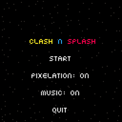
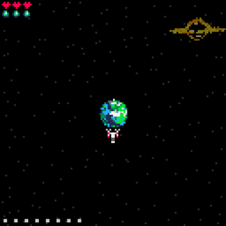
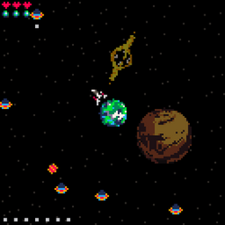
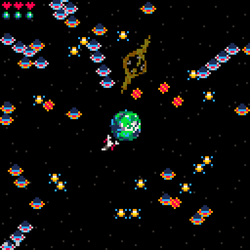
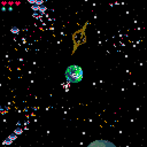

# ClashNSplash

ClashNSplash is a 2D retro planet defense game that was created for the "STOP WAITING FOR GODOT" jam hosted by Terry Cavanagh. It is a basic space shoot-em-up game where you defend your planet against alien spaceships. It is a demake of an old pc game called Clash N Slash.

Play at [itch.io](https://kakule.itch.io/clash-n-splash)

## Screenshots

### Start

### Gameplay

